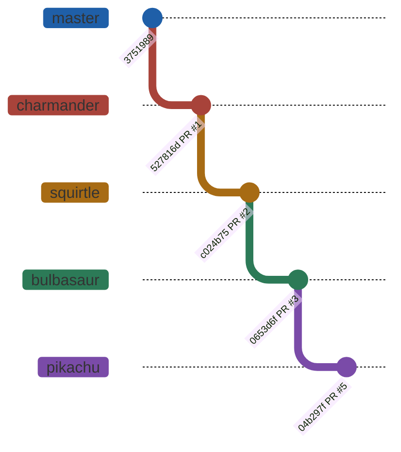
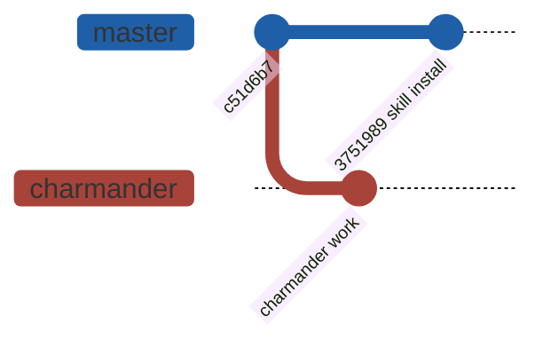
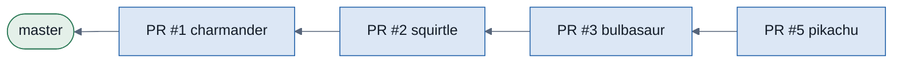

# Stacked PRs: `needsRebase` and merge order

> For the fully designed version of this guide, open [`stacked-pr-guide.html`](stacked-pr-guide.html) in a browser.

A stacked PR is not a normal PR: its base is the branch below it, not `master`. That single fact decides when a rebase is needed and what is allowed to merge first.

This repo's stack at the time this was written:

```
(master) <- charmander (#1) <- squirtle (#2) <- bulbasaur (#3) <- pikachu (#5)
```

## Part 1 — What `needsRebase` actually compares

Every branch in the stack stores one SHA: the tip of its parent *at the moment it was last aligned*. `gh stack view --json` reports it as `base`. The flag is a single comparison against that record:

- **`needsRebase: false`** — the parent's current tip is still an ancestor of this branch. Everything the parent has, this branch already contains.
- **`needsRebase: true`** — the parent's tip is no longer an ancestor. The parent moved on and this branch was left behind.

When the stack was fully synced, every layer's stored base was exactly its parent's current head:

| Branch | Stored base | Parent's tip | Contained? | needsRebase |
|---|---|---|---|---|
| charmander | `3751989` | master `3751989` | yes | `false` |
| squirtle | `527816d` | charmander `527816d` | yes | `false` |
| bulbasaur | `c024b75` | squirtle `c024b75` | yes | `false` |
| pikachu | `0653d6f` | bulbasaur `0653d6f` | yes | `false` |



*The stack in sync. One commit drawn per layer; each real branch carries its own commits on top of the layer below.*

### Three things flip it to `true`

- **You edit a lower layer.** New commits on `charmander` mean the three branches above no longer contain its tip.
- **Trunk moves.** This happened mid-session here: pushing the gh-stack skill install to `master` advanced it from `c51d6b7` to `3751989`, and `charmander` went stale instantly — then so did everything above it.
- **A PR below yours merges.** The merge puts new commits on the target branch that your branch has never seen.



*The real stale state seen earlier: charmander stored `c51d6b7`, master had moved to `3751989` — so master's tip was no longer an ancestor of charmander. `needsRebase: true`, cascading to every branch above it.*

Why it matters beyond tidiness: a stale layer's PR diff on GitHub stops showing only that layer's work. That is the entire point of stacking — a reviewer opening `#3` should see the bulbasaur change and nothing else.

## Part 2 — The one rule that governs merging

`gh stack merge` never merges a single PR in isolation. What you pass decides the **merge set**, and the set is all-or-nothing — if one PR in it cannot merge, none of them do.

| Command | Merge set |
|---|---|
| `gh stack merge 4 --yes` | every unmerged PR in stack #4 — all four |
| `gh stack merge 5 --yes` | PR #5 plus every unmerged PR below it — #1, #2, #3, #5 |
| `gh stack merge 2 --yes` | PR #2 plus #1 |
| `gh stack merge 1 --yes` | PR #1 alone — it sits on trunk |

> **Stack #4 holds four PRs, and the two numbers are unrelated.** The stack was assigned id 4 by GitHub; it contains PRs #1, #2, #3 and #5. Passing `4` means "the whole stack", not "PR #4".



*Each PR targets the branch below it. Nothing above charmander has a path to master that does not pass through charmander first.*

## Part 3 — Four merge-order questions, answered

### Everything lands in master at once — **what you want**

One command, one merge set, all four PRs. Because the operation is all-or-nothing, either master gets the complete feature or nothing moves at all — no half-landed state to clean up.

```bash
gh stack merge 4 --yes --squash   # or --merge / --rebase
```

Lowest-friction path: no intermediate rebase cascade, because nothing sits above an already-merged branch waiting to be repointed.

### Squirtle gets approved — merge it right away? — **wait**

No, and not because of policy — because of plumbing. PR #2's base is `charmander`, not `master`. Merging it "right away" would move squirtle's commits into the charmander branch, which is not where you want them.

Asking gh-stack to send it to master instead means `gh stack merge 2 --yes`, whose merge set is **#2 and #1 together**. Squirtle's approval alone can never land squirtle alone. Approval on a middle layer is a green light for that layer's review, not a green light to merge.

### Only pikachu is approved — **nothing can land**

Pikachu is the top of the stack, so its merge set is the entire stack: #5, #3, #2 and #1. Approving only the top approves the smallest amount of useful surface — pikachu's commits physically sit on top of the other three, so they cannot reach master without them.

```bash
gh stack merge 5 --yes   # set = #1 + #2 + #3 + #5, all-or-nothing
```

If the lower PRs are not mergeable, the command reports why and merges nothing. Approval flows bottom-up in a stack; the top is always last, never first.

### Charmander is approved and merged now — **legal, but costs you a cascade**

This one is legal — charmander sits directly on trunk, so it can go alone. The cost lands on the three branches above it:

- PR #2's base has to be repointed from `charmander` to `master`.
- If you **squash**-merge, master gets one brand-new commit and charmander's original commits never appear in master's history — so squirtle is still carrying commits whose content is already in master. Replaying them naively duplicates work and invites conflicts.
- All three branches above flip to `needsRebase: true` until re-synced.

gh-stack handles exactly this with `--onto`, but its `sync`/`rebase` commands cannot run in a worktree-per-branch layout (see Part 4). The manual equivalent, bottom-up:

```bash
# in the squirtle worktree — replay squirtle's own commits onto master,
# dropping charmander's now-merged ones
git fetch origin
git rebase --onto origin/master charmander squirtle

# then cascade upward, one worktree at a time
git rebase squirtle    # in the bulbasaur worktree
git rebase bulbasaur   # in the pikachu worktree

gh stack push          # pushes every branch in one shot
```

## Part 4 — The constraint specific to this repo

Every branch here lives in its own git worktree. `gh stack sync` and `gh stack rebase` both work by running `git checkout` on each branch in turn, and git refuses to check out a branch that another worktree already holds. Both commands fail with `already used by worktree`.

So the division of labour is fixed: gh-stack owns the GitHub side (`link`, `view`, `push`, `merge`), and plain `git rebase` per worktree does the local replaying. That's why partial merges cost noticeably more here than they would in a single-worktree checkout.

> **No branch protection, no required reviews, no merge queue on this repo.** "Approved" carries no enforcement — GitHub would let any mergeable PR through. Every ordering constraint above is structural, coming from the base-branch chain itself, not from review policy.

## Recommendation — landing everything at once

1. Leave all PRs open and merge nothing individually, however tempting a lone approval looks.
2. Collect review on all of them. A clean stack means each diff shows only its own layer.
3. Run the readiness check: `gh stack view --json`, confirm `needsRebase: false` across the board.
4. Land the whole stack in one operation: `gh stack merge <stack#> --yes --squash`.
5. Clean up afterwards — worktrees and local branches survive the merge unless removed explicitly (this repo does not auto-delete merged branches).
